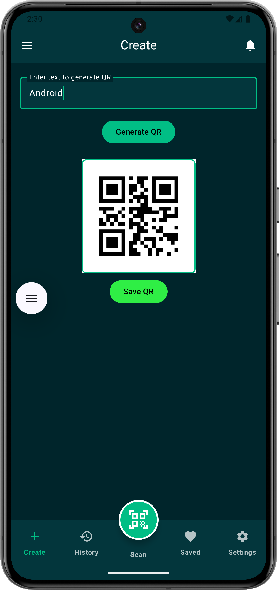
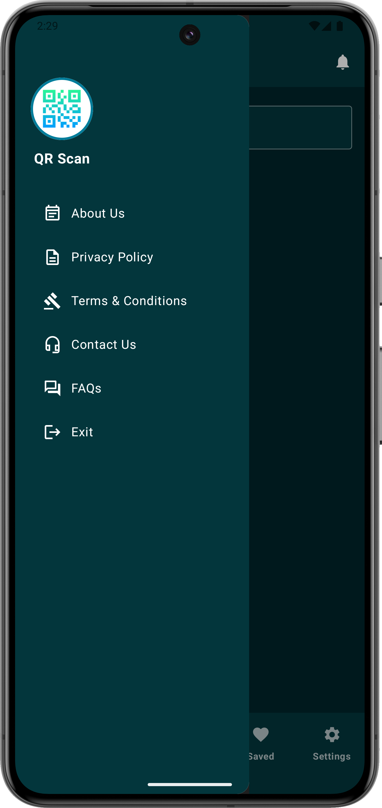
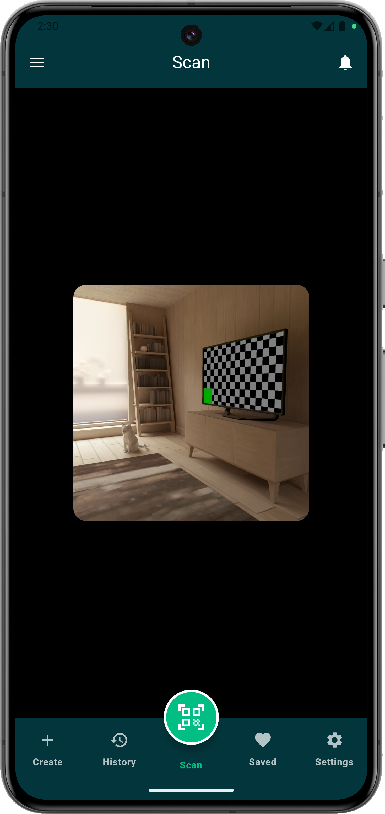
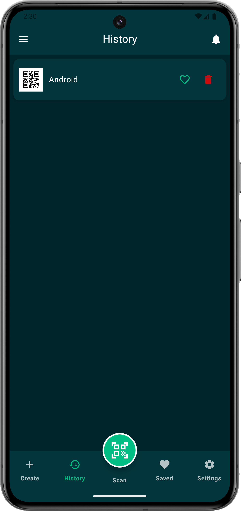
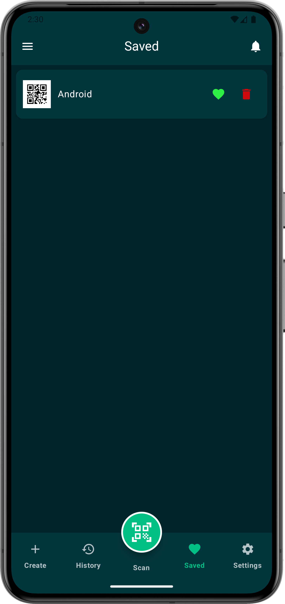
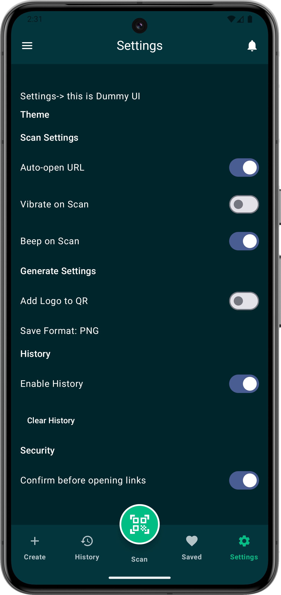

# Compose QR Scanner & Generator App (Jetpack Compose + MVVM + Compose Multiplatform)

A modern **QR Code Scanner and QR Code Generator** app built using **Jetpack Compose**, **MVVM Architecture**, and **Compose Multiplatform**. This project demonstrates clean architecture, state management with Kotlin, CameraX integration, scanning, and dynamic QR code generation.

## 🚀 Features

### 🔍 Scan QR Codes
- Fast real-time QR scanning
- CameraX support
- Flashlight toggle
- Scan history

### ✏️ Generate QR Codes
- Text to QR
- URL to QR
- Custom colors
- Save & Share

## 🛠️ Tech Stack
- Kotlin
- Jetpack Compose
- MVVM
- StateFlow
- Compose Multiplatform
- CameraX

## 📸 Screenshots

| Home Screen | Sidebar with Bottom Bar | Generate Screen |
|-------------|-----------------------------------------------|-----------------|
|  |  |  |


| History Screen                                  | favorite  Screen                               | Setting Screen                                      |
|-------------------------------------------------|-------------------------------------------------|-----------------------------------------------------|
|  |  |  |
|                                                 |                                                 |                                                     |

## 🔧 How to Run

```bash
git clone https://github.com/Dinesh2510/QR-Code-Scanner-Generator-App-in-Jetpack-Compose-with-MVVM-Architecture-Compose-Multiplatform.git
```

Open in Android Studio and run.

## 🛡️ License
MIT License.
